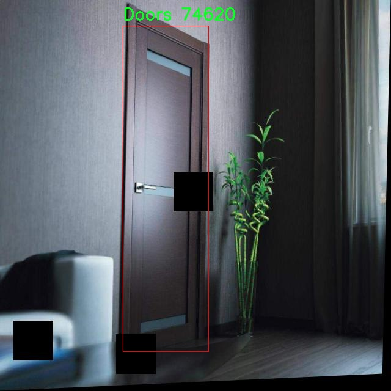

# 门检测检测系统源码分享
 # [一条龙教学YOLOV8标注好的数据集一键训练_70+全套改进创新点发刊_Web前端展示]

### 1.研究背景与意义

项目参考[AAAI Association for the Advancement of Artificial Intelligence](https://gitee.com/qunshansj/projects)

项目来源[AACV Association for the Advancement of Computer Vision](https://gitee.com/qunmasj/projects)

研究背景与意义

随着智能家居和自动化技术的迅速发展，门的智能检测与识别逐渐成为了一个重要的研究领域。门作为建筑物的重要组成部分，不仅在安全防护、隐私保护方面发挥着关键作用，同时也是人机交互的重要节点。传统的门检测方法往往依赖于人工观察或简单的传感器，这些方法在效率和准确性上存在诸多局限性。因此，基于计算机视觉的门检测系统应运而生，尤其是深度学习技术的迅猛发展，为门检测提供了新的解决方案。

在众多深度学习模型中，YOLO（You Only Look Once）系列因其高效的实时检测能力而备受关注。YOLOv8作为该系列的最新版本，进一步提升了目标检测的精度和速度，成为研究者们的热门选择。然而，针对特定场景（如盲人辅助系统）进行的门检测仍然面临着一些挑战，例如复杂环境下的光照变化、门的形状和颜色多样性等。因此，改进YOLOv8以适应门检测的特殊需求，具有重要的理论和实践意义。

本研究基于“DOORdetect FOR blinders”数据集，利用1900张标注清晰的门图像，开展门检测系统的改进与优化。该数据集的单一类别（门）使得模型在训练过程中能够专注于门的特征提取，避免了多类别干扰所带来的复杂性。这一特性为门检测模型的精确性和鲁棒性提供了良好的基础。此外，数据集的丰富性和多样性也为模型的泛化能力提供了保障，使其能够在不同环境下有效识别门的存在。

本研究的意义不仅在于提升门检测的准确性和实时性，更在于为盲人等特殊人群提供更加智能化的辅助工具。通过改进后的门检测系统，盲人用户能够在日常生活中更加自信地进行空间导航，减少因环境障碍物造成的安全隐患。这一技术的应用不仅有助于提升盲人用户的生活质量，也为智能家居系统的进一步发展奠定了基础。

综上所述，基于改进YOLOv8的门检测系统的研究，不仅具有重要的学术价值，也具备广泛的社会应用前景。通过深入探讨门检测技术的创新与实践，我们希望能够为智能家居领域的发展贡献一份力量，同时推动计算机视觉技术在社会服务中的应用，为更多需要帮助的人群提供便利。

### 2.图片演示


##### 注意：由于此博客编辑较早，上面“2.图片演示”和“3.视频演示”展示的系统图片或者视频可能为老版本，新版本在老版本的基础上升级如下：（实际效果以升级的新版本为准）

  （1）适配了YOLOV8的“目标检测”模型和“实例分割”模型，通过加载相应的权重（.pt）文件即可自适应加载模型。

  （2）支持“图片识别”、“视频识别”、“摄像头实时识别”三种识别模式。

  （3）支持“图片识别”、“视频识别”、“摄像头实时识别”三种识别结果保存导出，解决手动导出（容易卡顿出现爆内存）存在的问题，识别完自动保存结果并导出到tempDir中。

  （4）支持Web前端系统中的标题、背景图等自定义修改，后面提供修改教程。

  另外本项目提供训练的数据集和训练教程,暂不提供权重文件（best.pt）,需要您按照教程进行训练后实现图片演示和Web前端界面演示的效果。

### 3.视频演示

[3.1 视频演示](https://www.bilibili.com/video/BV1g9tweXEPt/)

### 4.数据集信息展示

##### 4.1 本项目数据集详细数据（类别数＆类别名）

nc: 1
names: ['Doors']


##### 4.2 本项目数据集信息介绍

数据集信息展示

在本研究中，我们使用了名为“DOORdetect FOR blinders”的数据集，旨在改进YOLOv8的门检测系统，以提高盲人和视障人士在日常生活中的导航能力。该数据集专门针对门的检测进行了优化，致力于为相关的计算机视觉任务提供高质量的训练数据。数据集的设计考虑到了视障人士在识别和接近门时所面临的挑战，因此在数据采集和标注过程中，特别注重了多样性和实用性。

“DOORdetect FOR blinders”数据集包含一个类别，即“Doors”。这一类别的设定反映了我们研究的核心目标，即准确识别和定位门的存在。门的种类繁多，包括但不限于单开门、双开门、滑动门、折叠门等。为了确保数据集的代表性，我们在不同的环境中收集了大量的门的图像，这些环境包括住宅、商业建筑、公共场所等。这种多样化的场景设置不仅增强了模型的泛化能力，也为视障人士提供了更为全面的导航信息。

在数据集的构建过程中，我们采用了高质量的图像采集设备，确保图像的清晰度和细节丰富性。每张图像都经过精心标注，确保门的边界框准确无误。这一过程不仅涉及到人工标注，还结合了先进的图像处理技术，以提高标注的效率和准确性。此外，数据集中还包含了不同光照条件和天气状况下的门的图像，以模拟真实世界中可能遇到的各种情况。这种全面的考虑使得“DOORdetect FOR blinders”数据集在实际应用中具有更高的实用价值。

为了进一步增强数据集的有效性，我们还进行了数据增强处理，包括旋转、缩放、裁剪等操作。这些技术手段不仅增加了数据集的样本数量，还提高了模型对不同姿态和视角的适应能力。通过这些措施，我们希望构建一个强大的门检测系统，使其能够在各种复杂环境中准确识别门的存在，从而为视障人士提供更好的辅助。

在训练过程中，我们将“DOORdetect FOR blinders”数据集与YOLOv8模型相结合，利用其先进的特征提取和目标检测能力，力求实现高效、准确的门检测。通过对数据集的不断优化和模型的迭代更新，我们期望能够显著提升门检测的精度和速度，为视障人士的出行安全提供更为可靠的技术支持。

总之，“DOORdetect FOR blinders”数据集不仅是一个门检测的训练工具，更是我们关注视障人士生活质量提升的重要一步。通过这一数据集的应用，我们希望能够推动计算机视觉技术在无障碍环境中的应用，帮助更多的视障人士实现独立、安全的生活。




### 5.全套项目环境部署视频教程（零基础手把手教学）

[5.1 环境部署教程链接（零基础手把手教学）](https://www.ixigua.com/7404473917358506534?logTag=c807d0cbc21c0ef59de5)


[5.2 安装Python虚拟环境创建和依赖库安装视频教程链接（零基础手把手教学）](https://www.ixigua.com/7404474678003106304?logTag=1f1041108cd1f708b01a)

### 6.手把手YOLOV8训练视频教程（零基础小白有手就能学会）

[6.1 手把手YOLOV8训练视频教程（零基础小白有手就能学会）](https://www.ixigua.com/7404477157818401292?logTag=d31a2dfd1983c9668658)

### 7.70+种全套YOLOV8创新点代码加载调参视频教程（一键加载写好的改进模型的配置文件）

[7.1 70+种全套YOLOV8创新点代码加载调参视频教程（一键加载写好的改进模型的配置文件）](https://www.ixigua.com/7404478314661806627?logTag=29066f8288e3f4eea3a4)

### 8.70+种全套YOLOV8创新点原理讲解（非科班也可以轻松写刊发刊，V10版本正在科研待更新）

由于篇幅限制，每个创新点的具体原理讲解就不一一展开，具体见下列网址中的创新点对应子项目的技术原理博客网址【Blog】：


[8.1 70+种全套YOLOV8创新点原理讲解链接](https://gitee.com/qunmasj/good)

### 9.系统功能展示（检测对象为举例，实际内容以本项目数据集为准）

图9.1.系统支持检测结果表格显示

  图9.2.系统支持置信度和IOU阈值手动调节

  图9.3.系统支持自定义加载权重文件best.pt(需要你通过步骤5中训练获得)

  图9.4.系统支持摄像头实时识别

  图9.5.系统支持图片识别

  图9.6.系统支持视频识别

  图9.7.系统支持识别结果文件自动保存

  图9.8.系统支持Excel导出检测结果数据


### 10.原始YOLOV8算法原理

原始YOLOv8算法原理

YOLOv8模型是由Ultralytics团队在2023年1月提出的最新版本目标检测算法，它在YOLOv5的基础上，结合了近两年半内经过实际验证的多项改进，旨在提升目标检测的精度和速度。该模型的设计理念依然延续了YOLO系列一贯的特性，即实时性和高效性，但在结构和功能上进行了重要的创新和优化，使其在复杂场景下的表现更加出色。

YOLOv8模型的整体架构可以分为输入层、主干网络、颈部网络和头部网络四个主要部分。输入层负责对输入图像进行预处理，包括缩放和归一化，以适应模型的输入要求。接下来，主干网络通过卷积操作对图像进行特征提取，采用了批归一化和SiLU激活函数，以增强模型的非线性表达能力。与之前的YOLO版本相比，YOLOv8在主干网络中引入了C2f模块，这一模块在C3模块的基础上进行了改进，借鉴了YOLOv7中的ELAN结构，增加了更多的跳层连接。这种设计使得梯度流动更加顺畅，从而提高了模型的训练效率和检测精度。

在特征提取的过程中，YOLOv8仍然保留了SPPF（Spatial Pyramid Pooling Fast）模块，该模块通过三个最大池化层处理多尺度特征，进一步增强了网络的特征抽象能力。这样的设计不仅提升了模型对不同尺度目标的检测能力，还有效减少了计算时间，确保了模型在实时应用中的高效性。

颈部网络是YOLOv8的重要组成部分，它通过特征金字塔网络（FPN）和路径聚合网络（PAN）结构融合来自不同尺度的特征图信息。这一过程有助于将低层次的细节信息与高层次的语义信息结合，从而提升目标检测的准确性。通过这样的特征融合，YOLOv8能够更好地捕捉到目标的多样性和复杂性，尤其是在复杂背景和遮挡情况下的表现尤为突出。

在头部网络的设计上，YOLOv8采用了解耦检测头的策略，这一创新源自于YOLOX模型。解耦检测头通过两个并行的卷积分支分别计算类别和位置特征，使得分类任务和定位任务能够独立优化。分类任务更注重于分析特征图中提取到的特征与已有类别的相似性，而定位任务则关注边界框与真实框之间的关系。这样的设计使得模型在训练过程中能够更快收敛，并在预测时提供更高的精度。

此外，YOLOv8还引入了无锚框结构，直接预测目标的中心点，并采用任务对齐学习（TAL）方法来区分正负样本。TAL通过引入分类分数和IOU的高次幂乘积作为衡量任务对齐程度的指标，确保在分类和定位损失函数中都能同时优化这两项任务。这种方法的引入，使得YOLOv8在目标检测的准确性和效率上都有了显著提升。

在模型的实际应用中，YOLOv8表现出了优越的性能。通过在COCO数据集上的测试，YOLOv8在不同尺寸的模型中，参数量没有显著增加的情况下，取得了比其他模型更好的精度。同时，在推理速度上，YOLOv8也展现出了更快的响应时间，适应了实时目标检测的需求。这些优势使得YOLOv8在智能监控、自动驾驶、机器人视觉等领域具有广泛的应用前景。

总的来说，YOLOv8模型的设计充分考虑了目标检测任务的实际需求，通过一系列创新的结构和方法，提升了模型的鲁棒性和泛化能力。其在特征提取、特征融合和任务优化等方面的改进，使得YOLOv8在保持高效性的同时，进一步提高了检测精度，为未来的研究和应用提供了新的可能性。随着YOLOv8的推广和应用，目标检测技术将迎来新的发展机遇，为各类智能系统的实现奠定更加坚实的基础。


### 11.项目核心源码讲解（再也不用担心看不懂代码逻辑）

#### 11.1 ui.py

以下是经过简化和注释的核心代码部分：

```python
import sys
import subprocess
from QtFusion.path import abs_path

def run_script(script_path):
    """
    使用当前 Python 环境运行指定的脚本。

    Args:
        script_path (str): 要运行的脚本路径
    """
    # 获取当前 Python 解释器的路径
    python_path = sys.executable

    # 构建运行命令，使用 streamlit 运行指定的脚本
    command = f'"{python_path}" -m streamlit run "{script_path}"'

    # 执行命令并等待其完成
    result = subprocess.run(command, shell=True)
    
    # 检查命令执行结果，如果返回码不为0，表示出错
    if result.returncode != 0:
        print("脚本运行出错。")

# 主程序入口
if __name__ == "__main__":
    # 获取要运行的脚本的绝对路径
    script_path = abs_path("web.py")

    # 调用函数运行脚本
    run_script(script_path)
```

### 代码分析和注释：
1. **导入模块**：
   - `sys`：用于访问与 Python 解释器紧密相关的变量和函数。
   - `subprocess`：用于生成新进程、连接到它们的输入/输出/错误管道，并获得它们的返回码。
   - `abs_path`：从 `QtFusion.path` 模块导入的函数，用于获取文件的绝对路径。

2. **`run_script` 函数**：
   - 该函数接受一个脚本路径作为参数，并使用当前 Python 环境运行该脚本。
   - 使用 `sys.executable` 获取当前 Python 解释器的路径。
   - 构建一个命令字符串，该命令使用 `streamlit` 运行指定的脚本。
   - 使用 `subprocess.run` 执行命令，并等待其完成。
   - 检查命令的返回码，如果不为0，则打印错误信息。

3. **主程序入口**：
   - 使用 `if __name__ == "__main__":` 确保只有在直接运行该脚本时才会执行以下代码。
   - 调用 `abs_path` 函数获取 `web.py` 的绝对路径。
   - 调用 `run_script` 函数来运行指定的脚本。 

这个简化后的代码保留了核心功能，并添加了详细的中文注释，便于理解代码的作用和流程。

这个文件名为 `ui.py`，其主要功能是通过当前的 Python 环境来运行一个指定的脚本。代码首先导入了必要的模块，包括 `sys`、`os` 和 `subprocess`，以及一个自定义的路径处理函数 `abs_path`，这个函数可能用于获取脚本的绝对路径。

在 `run_script` 函数中，首先获取当前 Python 解释器的路径，使用 `sys.executable` 来实现。接着，构建一个命令字符串，这个命令会调用 `streamlit` 模块来运行指定的脚本。`streamlit` 是一个用于构建数据应用的库，因此这个脚本的目的是运行一个基于 Streamlit 的应用。

随后，使用 `subprocess.run` 方法来执行构建好的命令。这个方法会在一个新的 shell 中运行命令，并等待其完成。如果命令执行后返回的状态码不为零，表示执行过程中出现了错误，程序会打印出“脚本运行出错”的提示信息。

在文件的最后部分，使用 `if __name__ == "__main__":` 语句来确保当该文件作为主程序运行时才会执行后面的代码。在这里，首先调用 `abs_path` 函数来获取 `web.py` 脚本的绝对路径，然后调用 `run_script` 函数来运行这个脚本。

总的来说，这个文件的作用是提供一个简单的接口来运行一个 Streamlit 应用，便于开发者在命令行中启动和调试他们的应用。

#### 11.2 70+种YOLOv8算法改进源码大全和调试加载训练教程（非必要）\ultralytics\engine\model.py

以下是经过简化和注释的核心代码部分，保留了YOLO模型的主要功能和结构：

```python
import torch
from pathlib import Path
from typing import Union
from ultralytics.nn.tasks import nn
from ultralytics.utils import callbacks, checks, yaml_load

class Model(nn.Module):
    """
    YOLO模型的基类，统一所有模型的API。

    参数:
        model (str, Path): 要加载或创建的模型文件路径。
        task (Any, optional): YOLO模型的任务类型。默认为None。
    """

    def __init__(self, model: Union[str, Path] = 'yolov8n.pt', task=None) -> None:
        """
        初始化YOLO模型。

        参数:
            model (Union[str, Path], optional): 要加载或创建的模型路径或名称。默认为'yolov8n.pt'。
            task (Any, optional): YOLO模型的任务类型。默认为None。
        """
        super().__init__()
        self.callbacks = callbacks.get_default_callbacks()  # 获取默认回调
        self.model = None  # 模型对象
        self.task = task  # 任务类型
        model = str(model).strip()  # 去除空格

        # 检查是否为Ultralytics HUB模型
        if self.is_hub_model(model):
            from ultralytics.hub.session import HUBTrainingSession
            self.session = HUBTrainingSession(model)  # 创建HUB训练会话
            model = self.session.model_file

        # 加载或创建新的YOLO模型
        suffix = Path(model).suffix
        if suffix in ('.yaml', '.yml'):
            self._new(model, task)  # 从配置文件初始化新模型
        else:
            self._load(model, task)  # 从权重文件加载模型

    def _new(self, cfg: str, task=None):
        """
        从模型定义初始化新模型并推断任务类型。

        参数:
            cfg (str): 模型配置文件
            task (str | None): 模型任务
        """
        cfg_dict = yaml_load(cfg)  # 加载YAML配置
        self.task = task or self.guess_model_task(cfg_dict)  # 推断任务类型
        self.model = self._smart_load('model')(cfg_dict)  # 构建模型

    def _load(self, weights: str, task=None):
        """
        从权重文件初始化新模型并推断任务类型。

        参数:
            weights (str): 要加载的模型检查点
            task (str | None): 模型任务
        """
        self.model, _ = self.attempt_load_one_weight(weights)  # 加载权重
        self.task = self.model.args['task']  # 获取任务类型

    def predict(self, source=None, **kwargs):
        """
        使用YOLO模型进行预测。

        参数:
            source (str | int | PIL | np.ndarray): 要进行预测的图像源。
            **kwargs: 传递给预测器的其他关键字参数。

        返回:
            (List[ultralytics.engine.results.Results]): 预测结果。
        """
        if source is None:
            source = 'default_source'  # 默认源
        # 进行预测
        return self.model.predict(source=source, **kwargs)

    def is_hub_model(self, model):
        """检查提供的模型是否为HUB模型。"""
        return model.startswith('https://hub.ultralytics.com/models/')

    def _smart_load(self, key):
        """加载模型/训练器/验证器/预测器。"""
        # 这里可以根据任务类型加载相应的组件
        return self.task_map[self.task][key]

    @property
    def task_map(self):
        """任务映射到模型、训练器、验证器和预测器类的映射。"""
        raise NotImplementedError('请为您的模型提供任务映射！')
```

### 代码说明：
1. **Model类**：这是YOLO模型的核心类，负责模型的初始化、加载和预测。
2. **__init__方法**：构造函数，接受模型路径和任务类型，初始化模型。
3. **_new方法**：从配置文件初始化新模型并推断任务类型。
4. **_load方法**：从权重文件加载模型并推断任务类型。
5. **predict方法**：执行预测，接受图像源和其他参数。
6. **is_hub_model方法**：检查模型是否为Ultralytics HUB模型。
7. **_smart_load方法**：根据任务类型加载相应的组件。
8. **task_map属性**：映射任务到模型、训练器、验证器和预测器的类，需实现具体逻辑。

以上代码是YOLO模型的核心部分，保留了主要功能，并添加了详细的中文注释以便理解。

这个程序文件是Ultralytics YOLO（You Only Look Once）模型的一个核心部分，主要用于定义和管理YOLO模型的各种功能和操作。文件中包含了一个名为`Model`的类，它继承自PyTorch的`nn.Module`，并封装了YOLO模型的加载、训练、预测等功能。

在类的构造函数中，`__init__`方法接收模型文件的路径和任务类型作为参数，并初始化了多个属性，包括模型对象、训练器对象、检查点、配置等。构造函数还会检查模型是否来自Ultralytics HUB或Triton Server，并根据文件后缀加载相应的模型。

类中定义了多个方法，例如`__call__`方法使得类的实例可以像函数一样被调用，实际调用的是`predict`方法进行目标检测。`_new`和`_load`方法用于初始化新模型或加载已有模型，并推断任务类型。`_check_is_pytorch_model`方法确保加载的模型是PyTorch格式，避免错误。

模型的重置、信息日志、模型融合等功能也被封装在类中，分别由`reset_weights`、`info`和`fuse`方法实现。`predict`方法用于执行预测，接受多种输入源，包括图像路径、视频流等，并返回预测结果。

此外，类还提供了训练、验证、超参数调优等功能，分别由`train`、`val`和`tune`方法实现。训练过程中可以使用自定义的训练器，支持从配置文件加载参数。`benchmark`和`export`方法则用于评估模型性能和导出模型。

在类的属性中，`names`、`device`和`transforms`分别返回模型的类别名称、设备信息和变换操作。还有一些用于回调管理的方法，如`add_callback`、`clear_callback`和`reset_callbacks`，允许用户在训练或预测过程中添加自定义的回调函数。

最后，类中还有一些静态方法和私有方法，用于辅助操作和内部逻辑处理，比如`_smart_load`用于智能加载模型相关组件，`_reset_ckpt_args`用于重置加载模型时的参数。

总的来说，这个文件是YOLOv8模型的基础框架，提供了丰富的功能以支持模型的加载、训练、预测和评估等操作，适用于计算机视觉任务中的目标检测。

#### 11.3 code\ultralytics\trackers\basetrack.py

以下是代码中最核心的部分，并附上详细的中文注释：

```python
from collections import OrderedDict
import numpy as np

class TrackState:
    """
    表示被跟踪对象可能状态的枚举类。

    属性：
        New (int): 对象新检测到的状态。
        Tracked (int): 对象在后续帧中成功跟踪的状态。
        Lost (int): 对象不再被跟踪的状态。
        Removed (int): 对象被移除跟踪的状态。
    """
    New = 0
    Tracked = 1
    Lost = 2
    Removed = 3


class BaseTrack:
    """
    对象跟踪的基类，提供基础属性和方法。

    属性：
        _count (int): 类级别的唯一跟踪ID计数器。
        track_id (int): 跟踪的唯一标识符。
        is_activated (bool): 标志表示跟踪是否当前处于激活状态。
        state (TrackState): 跟踪的当前状态。
        history (OrderedDict): 跟踪状态的有序历史记录。
        features (list): 从对象中提取的用于跟踪的特征列表。
        curr_feature (any): 当前被跟踪对象的特征。
        score (float): 跟踪的置信度分数。
        start_frame (int): 开始跟踪的帧编号。
        frame_id (int): 跟踪处理的最新帧ID。
        time_since_update (int): 自上次更新以来经过的帧数。
        location (tuple): 在多摄像头跟踪中的对象位置。

    方法：
        end_frame: 返回对象被跟踪的最后一帧ID。
        next_id: 增加并返回下一个全局跟踪ID。
        activate: 抽象方法，用于激活跟踪。
        predict: 抽象方法，用于预测跟踪的下一个状态。
        update: 抽象方法，用于用新数据更新跟踪。
        mark_lost: 将跟踪标记为丢失。
        mark_removed: 将跟踪标记为已移除。
        reset_id: 重置全局跟踪ID计数器。
    """

    _count = 0  # 类级别的跟踪ID计数器

    def __init__(self):
        """初始化一个新的跟踪，分配唯一ID和基础跟踪属性。"""
        self.track_id = 0  # 跟踪的唯一ID
        self.is_activated = False  # 跟踪是否激活的标志
        self.state = TrackState.New  # 跟踪的初始状态
        self.history = OrderedDict()  # 跟踪状态的历史记录
        self.features = []  # 特征列表
        self.curr_feature = None  # 当前特征
        self.score = 0  # 跟踪的置信度分数
        self.start_frame = 0  # 开始跟踪的帧编号
        self.frame_id = 0  # 最新处理的帧ID
        self.time_since_update = 0  # 自上次更新以来的帧数
        self.location = (np.inf, np.inf)  # 对象的位置，初始化为无穷大

    @property
    def end_frame(self):
        """返回跟踪的最后一帧ID。"""
        return self.frame_id

    @staticmethod
    def next_id():
        """增加并返回全局跟踪ID计数器。"""
        BaseTrack._count += 1
        return BaseTrack._count

    def activate(self, *args):
        """抽象方法，用于激活跟踪，需提供具体实现。"""
        raise NotImplementedError

    def predict(self):
        """抽象方法，用于预测跟踪的下一个状态，需提供具体实现。"""
        raise NotImplementedError

    def update(self, *args, **kwargs):
        """抽象方法，用于用新观察数据更新跟踪，需提供具体实现。"""
        raise NotImplementedError

    def mark_lost(self):
        """将跟踪标记为丢失。"""
        self.state = TrackState.Lost

    def mark_removed(self):
        """将跟踪标记为已移除。"""
        self.state = TrackState.Removed

    @staticmethod
    def reset_id():
        """重置全局跟踪ID计数器。"""
        BaseTrack._count = 0
```

### 代码核心部分解释：
1. **TrackState 类**：定义了跟踪对象的状态，包括新检测、成功跟踪、丢失和已移除的状态。
2. **BaseTrack 类**：这是一个抽象基类，提供了跟踪对象的基本结构和方法。它包含跟踪ID、状态、历史记录、特征等属性，并定义了一些抽象方法（如激活、预测和更新），这些方法需要在子类中实现。
3. **初始化方法**：在初始化时，设置跟踪的初始状态和其他属性。
4. **状态管理方法**：提供了标记丢失和已移除的功能，以及重置全局ID计数器的方法。

这个程序文件定义了一个用于对象跟踪的基础类和相关结构，主要用于YOLO（You Only Look Once）目标检测框架中的对象跟踪功能。文件中包含了两个主要的类：`TrackState`和`BaseTrack`。

`TrackState`类是一个枚举类，用于表示被跟踪对象的可能状态。它定义了四种状态：`New`表示对象是新检测到的，`Tracked`表示对象在后续帧中成功被跟踪，`Lost`表示对象不再被跟踪，`Removed`表示对象已从跟踪中移除。

`BaseTrack`类是对象跟踪的基础类，提供了一些基本的属性和方法。该类包含了一个类级别的计数器`_count`，用于生成唯一的跟踪ID。每个跟踪实例都有一个唯一的`track_id`，一个布尔值`is_activated`来指示跟踪是否处于激活状态，以及一个`state`属性来表示当前的跟踪状态。`history`属性是一个有序字典，用于记录跟踪状态的历史，`features`是从对象中提取的特征列表，`curr_feature`是当前被跟踪对象的特征，`score`是跟踪的置信度分数，`start_frame`是跟踪开始的帧号，`frame_id`是最近处理的帧ID，`time_since_update`是自上次更新以来经过的帧数，`location`是对象在多摄像头跟踪中的位置。

`BaseTrack`类还定义了一些方法，包括获取最后一帧ID的`end_frame`属性，静态方法`next_id`用于递增并返回下一个全局跟踪ID，抽象方法`activate`、`predict`和`update`分别用于激活跟踪、预测下一个状态和更新跟踪，`mark_lost`和`mark_removed`方法用于将跟踪标记为丢失或移除，最后的静态方法`reset_id`用于重置全局跟踪ID计数器。

总体而言，这个文件为YOLO框架中的对象跟踪提供了一个基础结构，便于后续的具体实现和扩展。

#### 11.4 70+种YOLOv8算法改进源码大全和调试加载训练教程（非必要）\ultralytics\engine\__init__.py

当然可以。以下是对代码的核心部分进行提炼和详细注释的结果：

```python
# Ultralytics YOLO 🚀, AGPL-3.0 license

# 该代码是Ultralytics YOLO（You Only Look Once）模型的基础部分，YOLO是一种用于目标检测的深度学习模型。
# 该模型以其高效性和准确性而闻名，广泛应用于实时目标检测任务。

# YOLO模型的核心思想是将目标检测视为一个回归问题，直接从图像像素到边界框坐标和类别概率进行预测。
# 通过将整个图像划分为网格，YOLO能够同时预测多个边界框及其对应的类别。

# 下面是YOLO模型的核心部分（伪代码示例）：

class YOLO:
    def __init__(self, model_path):
        # 初始化YOLO模型，加载预训练的权重
        self.model = self.load_model(model_path)

    def load_model(self, model_path):
        # 加载模型权重
        # 这里通常会使用深度学习框架（如PyTorch或TensorFlow）来加载模型
        pass

    def predict(self, image):
        # 对输入图像进行预测
        # 1. 预处理图像（如调整大小、归一化等）
        # 2. 将图像输入到模型中进行前向传播
        # 3. 获取模型输出（边界框和类别概率）
        pass

    def post_process(self, outputs):
        # 对模型输出进行后处理
        # 1. 应用非极大值抑制（NMS）来去除冗余的边界框
        # 2. 根据置信度阈值筛选有效的检测结果
        pass

# 以上是YOLO模型的基本结构和核心功能，具体实现会根据不同的框架和版本有所不同。
```

### 注释说明：
1. **类定义**：`class YOLO` 定义了一个YOLO模型的类，包含初始化和预测等方法。
2. **初始化方法**：`__init__` 方法用于加载模型权重，确保模型在使用前已准备好。
3. **加载模型**：`load_model` 方法负责从指定路径加载预训练的模型权重。
4. **预测方法**：`predict` 方法用于对输入图像进行处理和预测，包含图像预处理和模型前向传播的步骤。
5. **后处理方法**：`post_process` 方法用于处理模型的输出结果，包括去除冗余边界框和筛选有效检测结果。

以上是YOLO模型的核心部分及其详细注释，旨在帮助理解YOLO的基本工作原理。

这个程序文件的开头部分包含了一条注释，说明了该文件属于Ultralytics YOLO项目，并且使用了AGPL-3.0许可证。Ultralytics YOLO是一个流行的目标检测算法，广泛应用于计算机视觉领域。AGPL-3.0许可证是一种开源许可证，允许用户自由使用、修改和分发代码，但要求在分发时也必须提供源代码，并且在使用该代码的服务中也需要公开源代码。

由于代码部分非常简短，仅包含一行注释，因此文件的具体功能和实现细节并未在此处体现。通常情况下，`__init__.py`文件用于标识一个目录为Python包，并可以包含包的初始化代码或导入其他模块。在Ultralytics YOLO项目中，这个文件可能用于设置包的环境，导入必要的模块或类，以便用户可以方便地使用YOLO算法进行目标检测。

总的来说，这个文件是Ultralytics YOLO项目的一部分，主要用于包的初始化和管理。虽然代码内容简单，但它在整个项目中起到了重要的结构性作用。

#### 11.5 code\ultralytics\nn\tasks.py

以下是代码中最核心的部分，并附上详细的中文注释：

```python
import torch
import torch.nn as nn

class BaseModel(nn.Module):
    """BaseModel类是Ultralytics YOLO系列模型的基类。"""

    def forward(self, x, *args, **kwargs):
        """
        模型的前向传播，处理单个尺度的输入。
        
        参数:
            x (torch.Tensor | dict): 输入图像张量或包含图像张量和真实标签的字典。
        
        返回:
            (torch.Tensor): 网络的输出。
        """
        if isinstance(x, dict):  # 如果输入是字典，表示训练或验证
            return self.loss(x, *args, **kwargs)  # 计算损失
        return self.predict(x, *args, **kwargs)  # 进行预测

    def predict(self, x, profile=False, visualize=False, augment=False, embed=None):
        """
        通过网络进行前向传播。
        
        参数:
            x (torch.Tensor): 输入张量。
            profile (bool): 如果为True，打印每层的计算时间，默认为False。
            visualize (bool): 如果为True，保存模型的特征图，默认为False。
            augment (bool): 在预测时是否进行图像增强，默认为False。
            embed (list, optional): 要返回的特征向量/嵌入的列表。
        
        返回:
            (torch.Tensor): 模型的最后输出。
        """
        if augment:
            return self._predict_augment(x)  # 进行增强预测
        return self._predict_once(x, profile, visualize, embed)  # 进行一次预测

    def _predict_once(self, x, profile=False, visualize=False, embed=None):
        """
        执行一次前向传播。
        
        参数:
            x (torch.Tensor): 输入张量。
            profile (bool): 如果为True，打印每层的计算时间，默认为False。
            visualize (bool): 如果为True，保存模型的特征图，默认为False。
            embed (list, optional): 要返回的特征向量/嵌入的列表。
        
        返回:
            (torch.Tensor): 模型的最后输出。
        """
        y, dt, embeddings = [], [], []  # 输出列表
        for m in self.model:  # 遍历模型中的每一层
            if m.f != -1:  # 如果不是来自前一层
                x = y[m.f] if isinstance(m.f, int) else [x if j == -1 else y[j] for j in m.f]  # 从早期层获取输入
            if profile:
                self._profile_one_layer(m, x, dt)  # 记录计算时间
            x = m(x)  # 运行当前层
            y.append(x if m.i in self.save else None)  # 保存输出
            if visualize:
                feature_visualization(x, m.type, m.i, save_dir=visualize)  # 可视化特征图
            if embed and m.i in embed:
                embeddings.append(nn.functional.adaptive_avg_pool2d(x, (1, 1)).squeeze(-1).squeeze(-1))  # 扁平化
                if m.i == max(embed):
                    return torch.unbind(torch.cat(embeddings, 1), dim=0)  # 返回嵌入
        return x  # 返回最后的输出

    def loss(self, batch, preds=None):
        """
        计算损失。
        
        参数:
            batch (dict): 用于计算损失的批次数据。
            preds (torch.Tensor | List[torch.Tensor]): 预测结果。
        """
        if not hasattr(self, "criterion"):
            self.criterion = self.init_criterion()  # 初始化损失函数

        preds = self.forward(batch["img"]) if preds is None else preds  # 获取预测结果
        return self.criterion(preds, batch)  # 计算损失

    def init_criterion(self):
        """初始化BaseModel的损失标准。"""
        raise NotImplementedError("compute_loss() needs to be implemented by task heads")


class DetectionModel(BaseModel):
    """YOLOv8检测模型。"""

    def __init__(self, cfg="yolov8n.yaml", ch=3, nc=None, verbose=True):
        """初始化YOLOv8检测模型，使用给定的配置和参数。"""
        super().__init__()
        self.yaml = cfg if isinstance(cfg, dict) else yaml_model_load(cfg)  # 加载配置

        # 定义模型
        ch = self.yaml["ch"] = self.yaml.get("ch", ch)  # 输入通道
        if nc and nc != self.yaml["nc"]:
            self.yaml["nc"] = nc  # 覆盖YAML中的类别数
        self.model, self.save = parse_model(deepcopy(self.yaml), ch=ch, verbose=verbose)  # 解析模型
        self.names = {i: f"{i}" for i in range(self.yaml["nc"])}  # 默认名称字典

        # 构建步幅
        m = self.model[-1]  # 获取最后一层
        if isinstance(m, (Detect, Segment, Pose, OBB)):
            s = 256  # 最小步幅的两倍
            m.bias_init()  # 仅运行一次
        else:
            self.stride = torch.Tensor([32])  # 默认步幅

        # 初始化权重和偏置
        initialize_weights(self)
        if verbose:
            self.info()  # 打印模型信息

    def init_criterion(self):
        """初始化DetectionModel的损失标准。"""
        return v8DetectionLoss(self)  # 返回YOLOv8检测损失
```

### 代码核心部分解释：
1. **BaseModel类**：这是所有YOLO模型的基类，定义了模型的基本结构和功能，包括前向传播、损失计算等。
2. **forward方法**：根据输入类型决定是进行预测还是计算损失。
3. **predict方法**：执行前向传播，处理输入并返回模型的输出。
4. **DetectionModel类**：继承自BaseModel，专门用于YOLOv8的检测任务，初始化模型配置并定义损失计算方法。

这个程序文件 `tasks.py` 是 Ultralytics YOLO 系列模型的核心部分，主要用于定义和实现不同类型的深度学习模型，包括目标检测、图像分割、姿态估计和分类等。文件中包含了多个类和函数，下面是对其主要内容的讲解。

首先，文件导入了一些必要的库和模块，包括 PyTorch 的神经网络模块、Ultralytics 的自定义模块以及一些工具函数。文件的结构围绕着不同的模型类展开，所有模型类都继承自 `BaseModel` 类。

`BaseModel` 类是所有模型的基类，提供了模型的基本功能，如前向传播、预测、损失计算等。它定义了 `forward` 方法，处理输入数据并调用相应的损失函数或预测方法。`predict` 方法执行模型的前向传播，并支持可视化和性能分析。`fuse` 方法用于将卷积层和批归一化层融合，以提高计算效率。

接下来是 `DetectionModel` 类，它是 `BaseModel` 的子类，专门用于目标检测任务。该类在初始化时加载模型配置，并构建模型结构。它还实现了特定于目标检测的预测和损失计算方法。

`OBBModel`、`SegmentationModel` 和 `PoseModel` 类分别继承自 `DetectionModel`，实现了有向边界框检测、图像分割和姿态估计的功能。每个模型类都实现了自己的损失函数初始化方法，以适应特定任务的需求。

`ClassificationModel` 类则是用于图像分类的模型，继承自 `BaseModel`，并在初始化时设置模型的配置和结构。

`RTDETRDetectionModel` 类实现了基于变换器的实时检测和跟踪模型，提供了针对该模型的特定损失计算和预测方法。

此外，文件中还定义了 `Ensemble` 类，用于组合多个模型的输出，以提高预测的准确性。

在文件的最后部分，定义了一些辅助函数，例如 `torch_safe_load` 用于安全加载模型权重，`attempt_load_weights` 和 `attempt_load_one_weight` 用于加载模型权重并处理模型兼容性问题，`parse_model` 用于解析模型配置并构建相应的 PyTorch 模型。

整体来看，这个文件为 YOLO 系列模型提供了一个灵活且高效的框架，支持多种计算机视觉任务的实现，并且具有良好的可扩展性和可维护性。

#### 11.6 train.py

以下是代码中最核心的部分，并附上详细的中文注释：

```python
class DetectionTrainer(BaseTrainer):
    """
    DetectionTrainer类，继承自BaseTrainer类，用于基于检测模型的训练。
    """

    def build_dataset(self, img_path, mode="train", batch=None):
        """
        构建YOLO数据集。

        参数:
            img_path (str): 包含图像的文件夹路径。
            mode (str): 模式，`train`表示训练模式，`val`表示验证模式，用户可以为每种模式自定义不同的数据增强。
            batch (int, optional): 批次大小，仅在`rect`模式下使用。默认为None。
        """
        gs = max(int(de_parallel(self.model).stride.max() if self.model else 0), 32)  # 获取模型的最大步幅
        return build_yolo_dataset(self.args, img_path, batch, self.data, mode=mode, rect=mode == "val", stride=gs)

    def get_dataloader(self, dataset_path, batch_size=16, rank=0, mode="train"):
        """构造并返回数据加载器。"""
        assert mode in ["train", "val"]  # 确保模式是训练或验证
        with torch_distributed_zero_first(rank):  # 如果使用分布式数据并行，只初始化数据集一次
            dataset = self.build_dataset(dataset_path, mode, batch_size)  # 构建数据集
        shuffle = mode == "train"  # 训练模式下打乱数据
        if getattr(dataset, "rect", False) and shuffle:
            LOGGER.warning("WARNING ⚠️ 'rect=True'与DataLoader的shuffle不兼容，设置shuffle=False")
            shuffle = False  # 如果是rect模式，禁用打乱
        workers = self.args.workers if mode == "train" else self.args.workers * 2  # 设置工作线程数
        return build_dataloader(dataset, batch_size, workers, shuffle, rank)  # 返回数据加载器

    def preprocess_batch(self, batch):
        """对一批图像进行预处理，包括缩放和转换为浮点数。"""
        batch["img"] = batch["img"].to(self.device, non_blocking=True).float() / 255  # 将图像转移到设备并归一化
        if self.args.multi_scale:  # 如果启用多尺度训练
            imgs = batch["img"]
            sz = (
                random.randrange(self.args.imgsz * 0.5, self.args.imgsz * 1.5 + self.stride)
                // self.stride
                * self.stride
            )  # 随机选择一个新的尺寸
            sf = sz / max(imgs.shape[2:])  # 计算缩放因子
            if sf != 1:  # 如果缩放因子不为1
                ns = [
                    math.ceil(x * sf / self.stride) * self.stride for x in imgs.shape[2:]
                ]  # 计算新的形状
                imgs = nn.functional.interpolate(imgs, size=ns, mode="bilinear", align_corners=False)  # 进行插值缩放
            batch["img"] = imgs  # 更新批次中的图像
        return batch

    def set_model_attributes(self):
        """设置模型的属性，包括类别数量和名称。"""
        self.model.nc = self.data["nc"]  # 将类别数量附加到模型
        self.model.names = self.data["names"]  # 将类别名称附加到模型
        self.model.args = self.args  # 将超参数附加到模型

    def get_model(self, cfg=None, weights=None, verbose=True):
        """返回一个YOLO检测模型。"""
        model = DetectionModel(cfg, nc=self.data["nc"], verbose=verbose and RANK == -1)  # 创建检测模型
        if weights:
            model.load(weights)  # 加载权重
        return model

    def get_validator(self):
        """返回YOLO模型验证器。"""
        self.loss_names = "box_loss", "cls_loss", "dfl_loss"  # 定义损失名称
        return yolo.detect.DetectionValidator(
            self.test_loader, save_dir=self.save_dir, args=copy(self.args), _callbacks=self.callbacks
        )

    def label_loss_items(self, loss_items=None, prefix="train"):
        """
        返回带标签的训练损失项字典。

        对于分类不需要，但对于分割和检测是必要的。
        """
        keys = [f"{prefix}/{x}" for x in self.loss_names]  # 创建损失项的键
        if loss_items is not None:
            loss_items = [round(float(x), 5) for x in loss_items]  # 将张量转换为5位小数的浮点数
            return dict(zip(keys, loss_items))  # 返回损失项字典
        else:
            return keys

    def plot_training_samples(self, batch, ni):
        """绘制带有注释的训练样本。"""
        plot_images(
            images=batch["img"],
            batch_idx=batch["batch_idx"],
            cls=batch["cls"].squeeze(-1),
            bboxes=batch["bboxes"],
            paths=batch["im_file"],
            fname=self.save_dir / f"train_batch{ni}.jpg",
            on_plot=self.on_plot,
        )

    def plot_metrics(self):
        """从CSV文件中绘制指标。"""
        plot_results(file=self.csv, on_plot=self.on_plot)  # 保存结果图像

    def plot_training_labels(self):
        """创建YOLO模型的标记训练图。"""
        boxes = np.concatenate([lb["bboxes"] for lb in self.train_loader.dataset.labels], 0)  # 合并所有边界框
        cls = np.concatenate([lb["cls"] for lb in self.train_loader.dataset.labels], 0)  # 合并所有类别
        plot_labels(boxes, cls.squeeze(), names=self.data["names"], save_dir=self.save_dir, on_plot=self.on_plot)  # 绘制标签
```

### 代码核心部分解释：
1. **DetectionTrainer类**：这是一个用于训练YOLO检测模型的类，继承自BaseTrainer。
2. **build_dataset方法**：用于构建YOLO数据集，支持训练和验证模式。
3. **get_dataloader方法**：构造数据加载器，确保在分布式训练中只初始化一次数据集。
4. **preprocess_batch方法**：对输入的图像批次进行预处理，包括归一化和可能的缩放。
5. **set_model_attributes方法**：设置模型的类别数量和名称。
6. **get_model方法**：返回一个YOLO检测模型，可以选择加载预训练权重。
7. **get_validator方法**：返回用于验证模型的验证器。
8. **label_loss_items方法**：返回训练损失项的字典。
9. **plot_training_samples、plot_metrics、plot_training_labels方法**：用于可视化训练样本、绘制指标和标记训练图。

这个程序文件 `train.py` 是一个用于训练 YOLO（You Only Look Once）目标检测模型的实现，继承自 `BaseTrainer` 类。程序的主要功能是构建数据集、处理数据、设置模型属性、训练模型以及可视化训练过程中的结果。

在程序的开头，导入了一些必要的库和模块，包括数学库、随机数生成库、深度学习相关的库（如 PyTorch）以及 YOLO 模型和数据处理的相关模块。接着定义了 `DetectionTrainer` 类，该类用于实现基于目标检测模型的训练。

`build_dataset` 方法用于构建 YOLO 数据集。它接收图像路径、模式（训练或验证）和批量大小作为参数，并根据这些参数构建数据集。这里使用了 `build_yolo_dataset` 函数来创建数据集，确保在验证模式下使用适当的图像增强。

`get_dataloader` 方法用于构建并返回数据加载器。它根据模式（训练或验证）初始化数据集，并设置是否打乱数据的顺序。这个方法确保在分布式训练时只初始化一次数据集。

`preprocess_batch` 方法用于对一批图像进行预处理，包括缩放和转换为浮点数格式。它还支持多尺度训练，通过随机选择图像大小来增强模型的鲁棒性。

`set_model_attributes` 方法用于设置模型的属性，包括类别数量和类别名称。这些信息会被附加到模型中，以便在训练过程中使用。

`get_model` 方法用于返回一个 YOLO 检测模型。如果提供了权重文件，它会加载这些权重。

`get_validator` 方法返回一个用于验证 YOLO 模型的验证器。它定义了损失名称，并创建一个 `DetectionValidator` 实例，用于在训练后评估模型性能。

`label_loss_items` 方法用于返回一个包含训练损失项的字典，便于监控训练过程中的损失变化。

`progress_string` 方法返回一个格式化的字符串，显示训练进度，包括当前的 epoch、GPU 内存使用情况、损失值、实例数量和图像大小。

`plot_training_samples` 方法用于绘制训练样本及其标注信息，以便于可视化训练数据的质量。

最后，`plot_metrics` 和 `plot_training_labels` 方法用于可视化训练过程中的指标和标签信息，分别从 CSV 文件中读取指标并绘制图表，以及创建带有标注的训练图像。

总体而言，这个文件提供了一个完整的框架，用于训练 YOLO 模型，包括数据准备、模型设置、训练过程监控和结果可视化等功能。

### 12.系统整体结构（节选）

### 整体功能和构架概括

该项目是一个基于 YOLOv8 的目标检测框架，旨在提供一个完整的解决方案用于训练、评估和部署目标检测模型。项目的架构分为多个模块，每个模块负责特定的功能，包括模型定义、数据处理、训练过程、跟踪算法和工具函数等。整体上，项目提供了灵活的接口和可扩展的结构，支持多种计算机视觉任务，如目标检测、图像分割和姿态估计。

主要模块包括：

- **模型定义**：包含模型的结构和前向传播逻辑。
- **数据处理**：负责数据集的构建、加载和预处理。
- **训练与验证**：实现模型的训练过程、损失计算和验证功能。
- **跟踪算法**：提供对象跟踪的基础结构。
- **工具与实用函数**：包括可视化、回调和其他辅助功能。

### 文件功能整理表

| 文件路径                                                                                              | 功能描述                                                                                                                                                     |
|-----------------------------------------------------------------------------------------------------|----------------------------------------------------------------------------------------------------------------------------------------------------------|
| `D:\tools\20240809\code\ui.py`                                                                     | 提供一个接口用于运行 Streamlit 应用，方便用户在命令行中启动和调试目标检测应用。                                                                                      |
| `D:\tools\20240809\code\70+种YOLOv8算法改进源码大全和调试加载训练教程（非必要）\ultralytics\engine\model.py` | 定义 YOLO 模型的结构和功能，包括模型的加载、训练、预测和评估等操作。                                                                                       |
| `D:\tools\20240809\code\code\ultralytics\trackers\basetrack.py`                                   | 实现对象跟踪的基础类，定义跟踪状态和跟踪对象的基本属性与方法。                                                                                             |
| `D:\tools\20240809\code\70+种YOLOv8算法改进源码大全和调试加载训练教程（非必要）\ultralytics\engine\__init__.py` | 用于包的初始化，标识目录为 Python 包，可能包含其他模块的导入。                                                                                             |
| `D:\tools\20240809\code\code\ultralytics\nn\tasks.py`                                             | 定义和实现不同类型的深度学习模型，包括目标检测、图像分割、姿态估计和分类等，提供模型的基本功能和结构。                                                       |
| `D:\tools\20240809\code\train.py`                                                                  | 实现 YOLO 模型的训练过程，包括数据集构建、模型设置、训练监控和结果可视化等功能。                                                                             |
| `D:\tools\20240809\code\70+种YOLOv8算法改进源码大全和调试加载训练教程（非必要）\ultralytics\utils\callbacks\raytune.py` | 提供与 Ray Tune 相关的回调函数，用于超参数调优和训练过程监控。                                                                                           |
| `D:\tools\20240809\code\70+种YOLOv8算法改进源码大全和调试加载训练教程（非必要）\ultralytics\nn\backbone\VanillaNet.py` | 定义 VanillaNet 作为 YOLO 模型的骨干网络，提供特征提取功能。                                                                                             |
| `D:\tools\20240809\code\70+种YOLOv8算法改进源码大全和调试加载训练教程（非必要）\ultralytics\data\base.py` | 提供数据集的基础类和数据加载功能，支持不同类型的数据集构建和处理。                                                                                       |
| `D:\tools\20240809\code\code\ultralytics\engine\exporter.py`                                      | 实现模型导出功能，支持将训练好的模型导出为不同格式，以便于部署和使用。                                                                                     |
| `D:\tools\20240809\code\70+种YOLOv8算法改进源码大全和调试加载训练教程（非必要）\ultralytics\__init__.py` | 用于包的初始化，标识目录为 Python 包，可能包含其他模块的导入。                                                                                             |
| `D:\tools\20240809\code\70+种YOLOv8算法改进源码大全和调试加载训练教程（非必要）\ultralytics\hub\auth.py` | 提供与 Ultralytics HUB 相关的身份验证功能，支持用户身份验证和访问控制。                                                                                   |

这个表格概述了每个文件的主要功能，帮助理解整个项目的结构和各个模块之间的关系。

注意：由于此博客编辑较早，上面“11.项目核心源码讲解（再也不用担心看不懂代码逻辑）”中部分代码可能会优化升级，仅供参考学习，完整“训练源码”、“Web前端界面”和“70+种创新点源码”以“13.完整训练+Web前端界面+70+种创新点源码、数据集获取”的内容为准。

### 13.完整训练+Web前端界面+70+种创新点源码、数据集获取


# [下载链接：https://mbd.pub/o/bread/ZpuVlJ9w](https://mbd.pub/o/bread/ZpuVlJ9w)